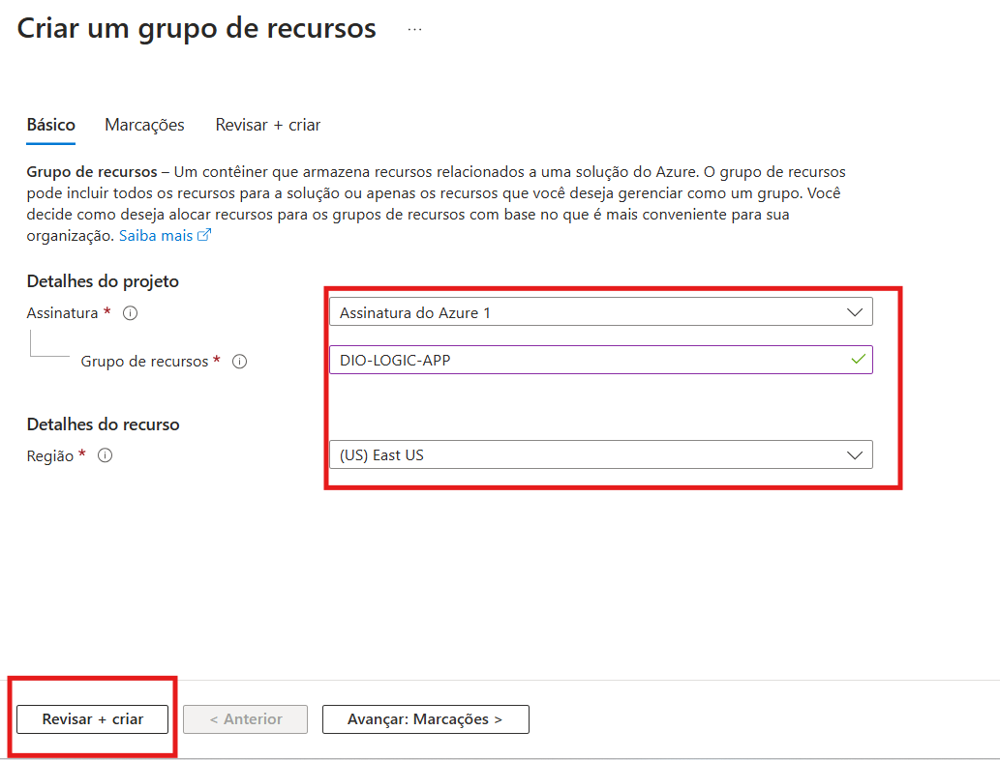

# Criando os recursos necessários para trabalhar com Aplicações Serverless na Azure

Primeiramente criaremos um resource group para armazenarmos os recursos da nossa aplicação.

Após a criação, clicamos em “Criar” para criarmos nosso primeiro **serverless**.

Selecionamos “Multilocatário” e “Selecionar”

